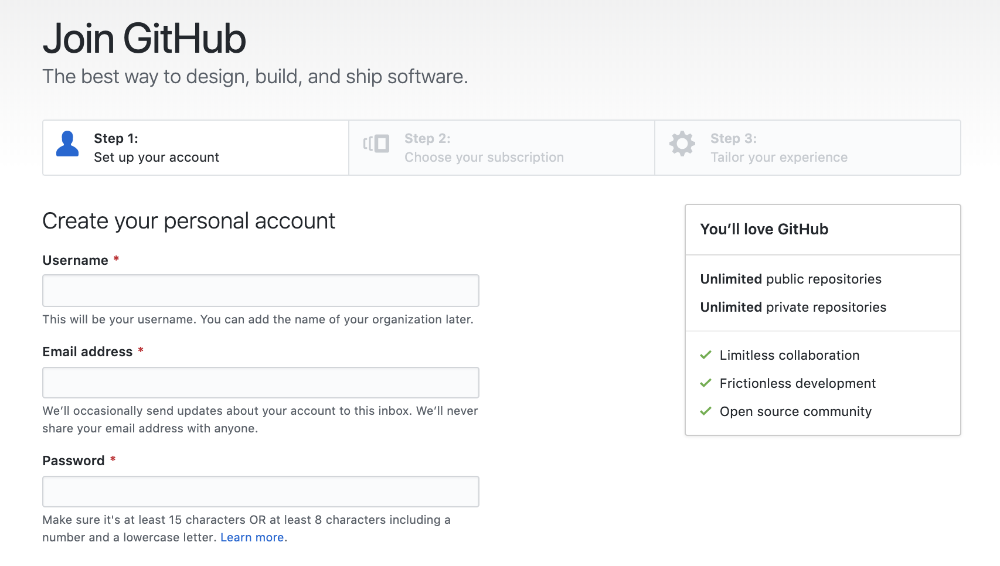
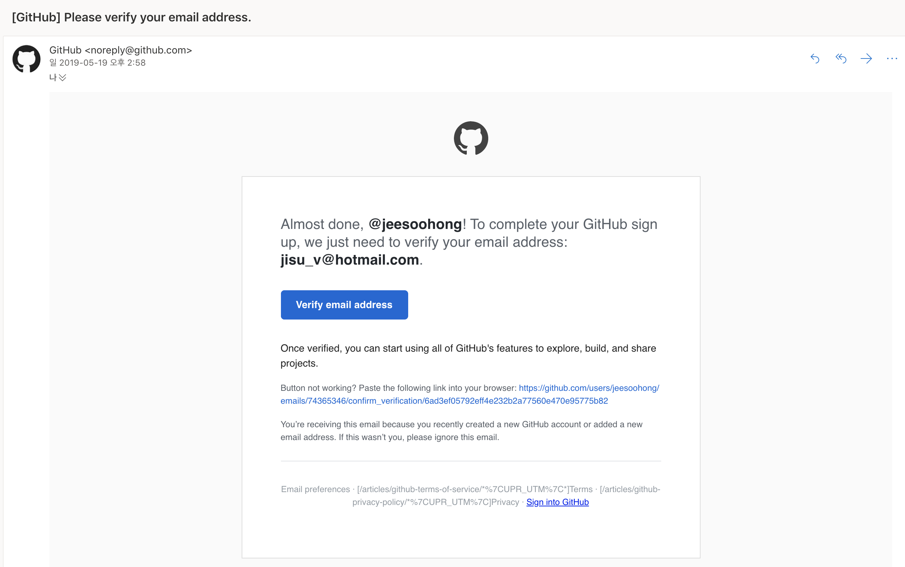

# 5-04. github 가입

Github 가입은 어렵지 않습니다. [github](https://github.com/) 사이트에서 sign-up을 누르시고 아래 차례에 따라 가입하시면 됩니다.

git config 등록 시 입력한 이메일 주소로 가입을 하시면 됩니다.

subscription은 무료 계정을 선택하시면 됩니다.

이메일 인증을 하시면 가입이 완료됩니다.
